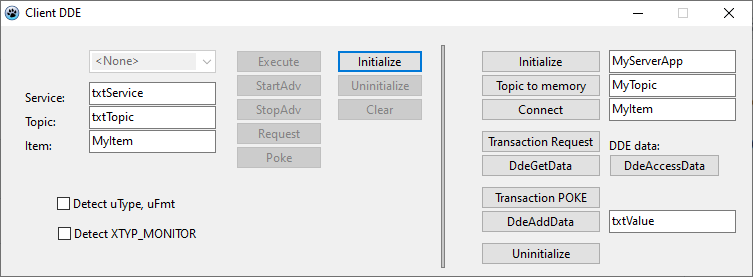
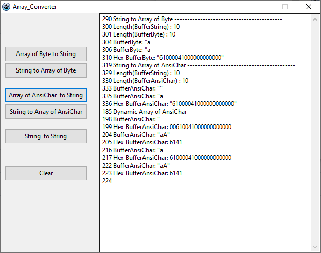
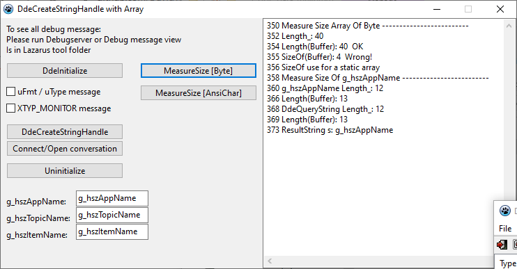
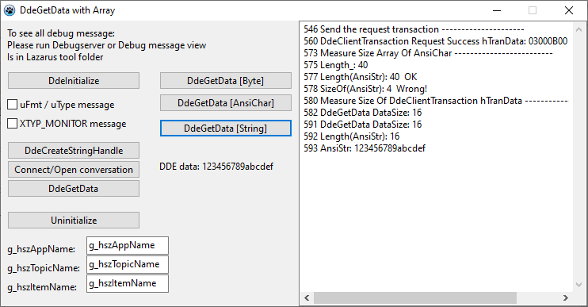

# DDE_Pascal
DDE for Pascal

 

 

wxipc-win32: https://sourceforge.net/projects/wxipc/

DebugServer(Tool already in Lazarus folder):
 - https://wiki.freepascal.org/DebugServer
 - $(LazarusDir)/tools/debugserver/debugserver.lpi 
